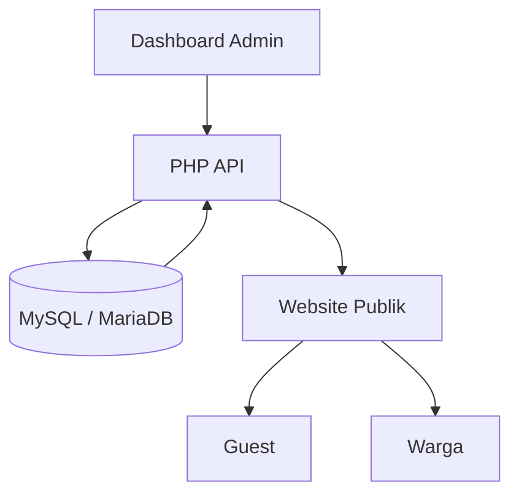
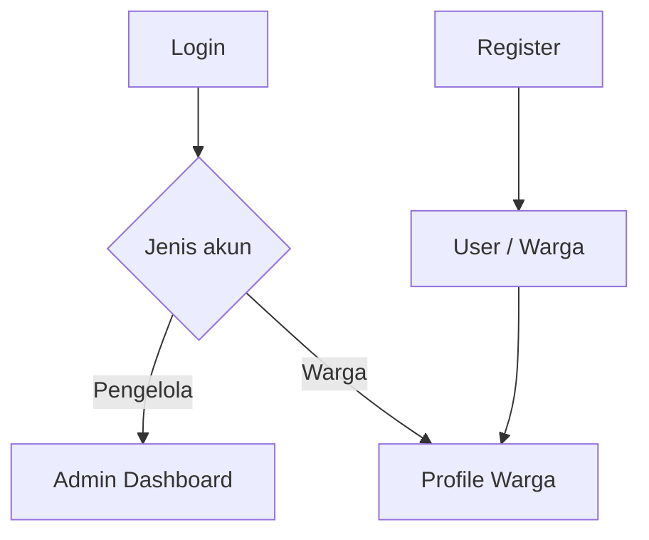
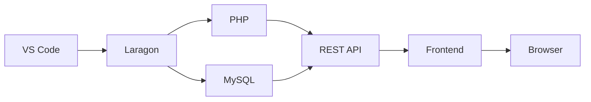
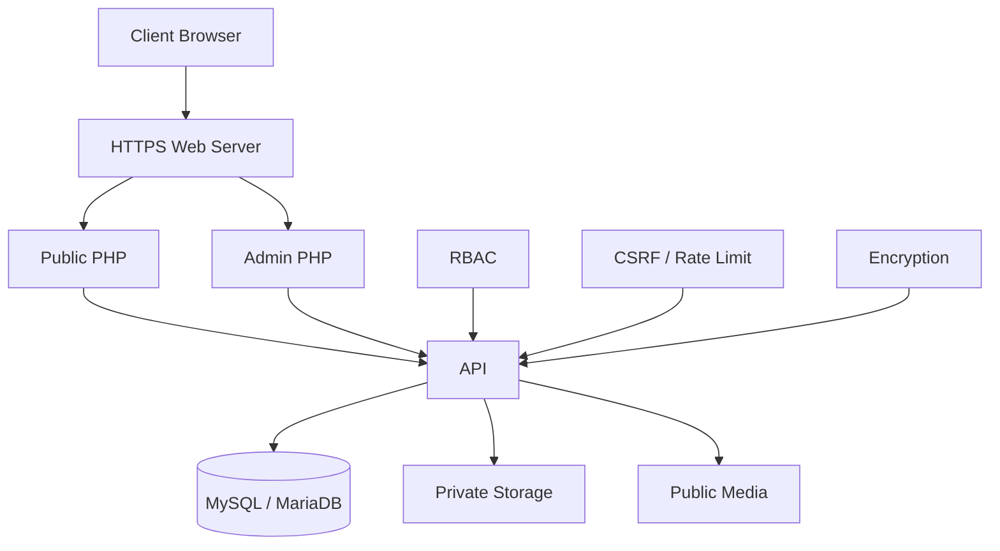

<div align="center">

# Portal Gampong Full-Stack

### Portal Pemerintahan Gampong 100% Data-Driven

Frontend modern HTML, CSS, JavaScript dengan backend PHP 8+, MySQL/MariaDB, autentikasi warga, RBAC, Dashboard Admin, SEO, PWA, dan keamanan produksi.

<br>


<br><br>


</div>

---

## Tentang Project

Portal Gampong adalah sistem website pemerintahan gampong berbasis:

```text
Admin
  ↓
MySQL / MariaDB
  ↓
PHP REST API
  ↓
Frontend
```

Prinsip utama project:

> Tidak ada data gampong dummy atau hard-coded pada halaman publik. Seluruh informasi yang dapat berubah dikelola melalui Dashboard Admin, disimpan di database, dikirim melalui API, lalu dirender ke website.

Fresh install membuat database, seluruh tabel, akun Super Admin, lalu memasukkan **master data Lamgugob yang memiliki dasar sumber** dari `backend/database/seed.sql`.

Seed bawaan bukan data dummy. Isinya mencakup identitas resmi, statistik BPS, tiga dusun, Keuchik yang terverifikasi, data historis Masjid Besar Syuhada, fasilitas publik yang teridentifikasi, koperasi, timeline, FAQ faktual, tautan cepat, dan sumber data.

Fresh install tetap **tidak membuat data yang belum terverifikasi**, termasuk APBG terbaru, daftar UMKM, perangkat selain Keuchik, kontak/jam pelayanan yang belum tersedia, foto, galeri, agenda aktif, serta SOP/persyaratan layanan yang belum diterbitkan. Modul tersebut menampilkan empty-state sampai Admin mengisinya.

---

# Fitur Utama

## Website Publik

Website publik dapat dibuka oleh:

```text
Guest
User / Warga
Admin
Operator
Super Admin
```

Pengunjung tidak diwajibkan login untuk mengakses informasi publik.

Fitur tersedia:

* Hero dinamis
* Identitas gampong
* Logo dinamis
* Foto pimpinan / Keuchik
* Profil gampong
* Sejarah
* Visi
* Misi
* Nilai pelayanan
* Komitmen
* Perangkat gampong
* Lembaga
* Wilayah, dusun, dan Ulee Jurong
* Batas wilayah dengan status verifikasi
* Masjid Besar Syuhada: sejarah, BKM, program, dan fasilitas
* Fasilitas publik
* Timeline gampong
* Statistik penduduk
* Statistik unggulan hero
* Diagram penduduk
* Layanan publik
* Persyaratan layanan
* Estimasi layanan
* Pengajuan surat
* Pengaduan masyarakat
* Cek tiket
* Berita
* Pengumuman
* Announcement ticker
* Agenda
* APBG
* Pembangunan
* UMKM
* Galeri
* Lightbox
* FAQ
* Akses cepat
* Google Maps
* Kontak
* Sosial media
* Tautan eksternal
* Sumber data
* Pencarian website
* Responsive UI
* Light mode
* Dark mode
* Accessibility font size
* Reduced motion
* PWA
* SEO teknis

---

# Data-Driven Architecture

Seluruh konten publik berasal dari database.



Frontend mengambil data utama menggunakan:

```text
GET api.php?action=content
```

Setelah data diubah dari Dashboard Admin:

```text
Admin Simpan
     ↓
Database
     ↓
API
     ↓
Frontend reload data
```

Tidak perlu mengubah:

```text
index.html
CSS
JavaScript
```

untuk memperbarui konten gampong.

---

# Sistem Role

Project menggunakan Role-Based Access Control pada backend.

Role internal:

```text
superadmin
admin
operator
user
guest
```

Role internal tidak perlu diperlihatkan kepada pengunjung website publik.

---

## Super Admin

Super Admin memiliki kontrol tertinggi terhadap sistem.

```text
Super Admin
├── Seluruh fitur Admin
├── Seluruh fitur Operator
├── Pengguna Admin
├── Pengguna Warga
├── Role pengguna
├── Reset password
├── Status akun
├── Audit Log
└── Pengaturan keamanan
```

---

## Admin

Admin berfungsi sebagai pengelola website dan data publik.

```text
Admin
├── Identitas Gampong
├── Hero
├── Profil
├── Perangkat
├── Lembaga
├── Wilayah & Dusun
├── Batas Wilayah
├── Fasilitas Publik
├── Masjid Syuhada
├── Timeline Gampong
├── Statistik
├── Layanan
├── Persyaratan
├── Berita
├── Pengumuman
├── Agenda
├── FAQ
├── UMKM
├── Galeri
├── APBG
├── Pembangunan
├── Navigasi
├── Sosial Media
├── Sumber Data
├── Pengajuan
└── Pengaduan
```

Admin tidak dapat:

```text
Mengelola role administrator
Menghapus Super Admin
Melihat fungsi sistem khusus Super Admin
```

---

## Operator

Operator berfungsi sebagai petugas pelayanan.

```text
Operator
├── Dashboard
├── Pengajuan Surat
│   ├── lihat
│   ├── verifikasi
│   ├── proses
│   ├── selesai
│   └── download dokumen
│
├── Pengaduan
│   ├── lihat
│   ├── review
│   ├── proses
│   └── selesai
│
└── Ubah Password
```

Operator tidak mempunyai permission untuk mengubah konten website.

---

## User / Warga

Warga dapat membuat akun melalui halaman register.

```text
Warga
├── Login
├── Profil
├── Update data
├── Riwayat pengajuan
├── Riwayat pengaduan
├── Cek status
├── Ubah password
└── Prefill layanan
```

Registrasi publik selalu menghasilkan akun:

```text
user
```

Registrasi tidak dapat menghasilkan:

```text
operator
admin
superadmin
```

---

## Guest

Guest tetap dapat menggunakan website tanpa login.

```text
Guest
├── Informasi publik
├── Berita
├── Statistik
├── APBG
├── Layanan
├── Pengajuan
├── Pengaduan
├── Galeri
├── FAQ
└── Cek tiket
```

---

# Matriks RBAC

| Kemampuan             | Super Admin | Admin | Operator |
| --------------------- | :---------: | :---: | :------: |
| Dashboard             |      Ya     |   Ya  |    Ya    |
| Lihat pengajuan       |      Ya     |   Ya  |    Ya    |
| Proses pengajuan      |      Ya     |   Ya  |    Ya    |
| Download berkas       |      Ya     |   Ya  |    Ya    |
| Lihat pengaduan       |      Ya     |   Ya  |    Ya    |
| Proses pengaduan      |      Ya     |   Ya  |    Ya    |
| Identitas gampong     |      Ya     |   Ya  |   Tidak  |
| Perangkat             |      Ya     |   Ya  |   Tidak  |
| Lembaga               |      Ya     |   Ya  |   Tidak  |
| Statistik             |      Ya     |   Ya  |   Tidak  |
| Layanan               |      Ya     |   Ya  |   Tidak  |
| Berita                |      Ya     |   Ya  |   Tidak  |
| Agenda                |      Ya     |   Ya  |   Tidak  |
| FAQ                   |      Ya     |   Ya  |   Tidak  |
| UMKM                  |      Ya     |   Ya  |   Tidak  |
| Galeri                |      Ya     |   Ya  |   Tidak  |
| APBG                  |      Ya     |   Ya  |   Tidak  |
| Pembangunan           |      Ya     |   Ya  |   Tidak  |
| Upload media          |      Ya     |   Ya  |   Tidak  |
| Export publik         |      Ya     |   Ya  |   Tidak  |
| Kelola pengguna admin |      Ya     | Tidak |   Tidak  |
| Kelola warga          |      Ya     | Tidak |   Tidak  |
| Audit Log             |      Ya     | Tidak |   Tidak  |

Permission diperiksa server-side.

```text
superadmin
dashboard
workflow.*
cms.*
settings.*
media.upload
export.public
users.manage
citizens.manage
audit.read
account.password
```

```text
admin
dashboard
workflow.*
cms.*
settings.*
media.upload
export.public
account.password
```

```text
operator
dashboard
workflow.read
workflow.update
workflow.download
account.password
```

---

# Authentication

Halaman autentikasi dipisahkan dari homepage.

```text
login.html
register.html
profile.html
```

Alur:



---

# Profile Warga

Halaman:

```text
/profile.html
```

Fitur:

```text
Dashboard Akun
├── Ringkasan
├── Profil
├── Pengajuan
├── Pengaduan
└── Keamanan
```

Informasi akun dapat mencakup:

```text
Nama
Email
NIK
Nomor HP
Alamat
Status akun
```

Saat warga login, form layanan dapat melakukan prefill otomatis.

---

# Sistem Pengajuan Surat

Admin membuat jenis layanan dari Dashboard.

Setiap layanan dapat memiliki:

```text
Nama
Kategori
Deskripsi
Icon
Estimasi
Persyaratan
Alur
Urutan
Online
Published
```

Hanya layanan:

```text
Online = Ya
Published = Ya
```

yang muncul pada formulir pengajuan.

---

## Workflow Pengajuan

```text
pending
   ↓
verified
   ↓
processing
   ↓
completed
```

Alternatif:

```text
rejected
```

---

# Pengaduan

Pengaduan dapat dikirim oleh:

```text
Guest
Warga
```

Data:

```text
Nama
Kontak
Kategori
Pesan
Privasi identitas
```

Workflow:

```text
new
 ↓
reviewed
 ↓
in_progress
 ↓
resolved
 ↓
closed
```

---

# Sistem Tiket

Pengajuan dan pengaduan menghasilkan nomor tiket otomatis.

Contoh format:

```text
PREFIX-TAHUN-RANDOM
```

Warga dapat mengecek status menggunakan endpoint:

```text
GET api.php?action=status&ticket=...
```

Response tidak menampilkan data sensitif.

---

# Keamanan Data

Data sensitif tidak disimpan sebagai plaintext.

Data terenkripsi:

```text
NIK
Nomor HP
Alamat
Nama pengadu
Kontak pengadu
Isi pengaduan
```

Enkripsi:

```text
AES-256-GCM
```

Password:

```php
password_hash()
password_verify()
```

NIK juga memiliki fingerprint menggunakan:

```text
HMAC-SHA256
```

untuk membantu mendeteksi registrasi NIK yang sama tanpa harus menyimpan NIK dalam plaintext.

---

# Security Features

Project dilengkapi dengan:

```text
RBAC
CSRF Protection
Rate Limiting
Password Hashing
AES-256-GCM
HttpOnly Cookie
SameSite Strict
Session Rotation
Session Idle Timeout
Upload Validation
Private Storage
Protected Backend
Protected Admin Assets
Content Security Policy
X-Content-Type-Options
X-Frame-Options
Permissions Policy
HSTS on HTTPS
Public Settings Whitelist
```

---

# Upload Security

Dokumen warga:

```text
PDF
JPG
JPEG
PNG
```

Ukuran maksimal:

```text
5 MB
```

Lokasi:

```text
backend/storage/private/
```

Folder tidak boleh diakses langsung dari browser.

Media publik:

```text
JPG
PNG
WEBP
```

Ukuran maksimal:

```text
4 MB
```

Script execution pada folder upload diblokir.

---

# SEO

Homepage menggunakan:

```text
index.php
```

sebagai server-side SEO wrapper.

Fitur SEO:

```text
Dynamic Title
Meta Description
Meta Keywords
Canonical
Open Graph
Twitter Card
JSON-LD
GovernmentOrganization Schema
NewsArticle Schema
robots.txt
sitemap.xml
Article Page
SEO Image
```

Artikel memiliki halaman:

```text
post.php?slug=...
```

---

# SEO Admin

Admin dapat mengatur:

```text
SEO Title
SEO Description
SEO Keywords
SEO Image
```

Setelah domain produksi aktif, sitemap tersedia melalui:

```text
/sitemap.xml
```

dan dapat didaftarkan ke search engine.

---

# Progressive Web App

Project mendukung PWA.

File utama:

```text
manifest.php
sw.js
```

Fitur:

```text
Dynamic Manifest
Installable Website
192x192 Icon
512x512 Icon
Favicon
Offline Static Assets
Theme Color
```

Data berikut tidak dicache:

```text
API
Authentication
Admin
Profile data
Backend
```

---

# Responsive Design

Layout dirancang untuk:

```text
Desktop
Laptop
Tablet Landscape
Tablet Portrait
Mobile
Small Mobile
```

Breakpoint utama:

```text
1180px
1020px
820px
680px
430px
380px
```

Komponen responsif:

```text
Navbar
Hero
Quick Access
Profile
Cards
Government Officials
Services
Statistics
APBG
News
Agenda
UMKM
Gallery
FAQ
Contact
Forms
Modal
Dashboard
Sidebar
Tables
Drawers
Auth Pages
Profile Pages
```

---

# Theme

Website mendukung:

```text
Light Mode
Dark Mode
```

Preference tersimpan di:

```text
localStorage
```

dengan key:

```text
gampong-theme
```

Theme diterapkan sebelum browser merender halaman untuk menghindari flash light/dark.

Dashboard admin menggunakan theme preference yang sama.

---

# Accessibility

Tersedia:

```text
A-
A
A+
```

untuk mengatur ukuran teks.

Fitur tambahan:

```text
Skip Link
Keyboard Navigation
Focus State
Reduced Motion
ARIA
Responsive Typography
```

---

# Database

Fresh database mempunyai tabel:

```text
admins
users
settings
government_officials
institutions
services
service_requirements
population_statistics
posts
agendas
umkm
galleries
budget_items
development_projects
faqs
quick_links
social_links
external_links
data_sources
village_areas
village_boundaries
public_facilities
village_milestones
mosque_management
mosque_programs
mosque_facilities
service_requests
complaints
rate_limits
audit_logs
```

File:

```text
backend/database/seed.sql
```

berisi master data Lamgugob yang memiliki dasar sumber dan tidak mengandung data contoh/dummy.

---

# Struktur Project

```text
gampong-lamgugob/
│
├── index.php
├── index.html
├── post.php
├── login.html
├── register.html
├── profile.html
│
├── api.php
├── manifest.php
├── robots.php
├── sitemap.php
├── robots.txt
├── sitemap.xml
├── sw.js
├── README.md
│
├── admin/
│   ├── index.php
│   ├── asset.php
│   └── assets/
│       ├── admin.css
│       ├── redesign.css
│       └── admin.js
│
├── backend/
│   ├── .env.example
│   ├── .htaccess
│   ├── api.php
│   ├── bootstrap.php
│   ├── config.php
│   ├── install.php
│   ├── reset-content.php
│   ├── seed-master-data.php
│   ├── rbac-selftest.php
│   ├── auth-selftest.php
│   │
│   ├── database/
│   │   ├── schema.sql
│   │   └── seed.sql
│   │
│   └── storage/
│       └── private/
│
└── assets/
    ├── css/
    │   ├── style.css
    │   ├── redesign.css
    │   └── account-pages.css
    │
    ├── js/
    │   ├── app.js
    │   ├── auth-pages.js
    │   └── profile.js
    │
    ├── images/
    ├── icons/
    └── uploads/
```

---

## Eye Comfort UI

Versi UI terbaru menggunakan warna solid dan tint lembut agar nyaman dipakai dalam waktu lama. Gradient dekoratif dikurangi, shadow dibuat lebih ringan, animasi non-esensial dikurangi, responsif diperkuat hingga layar mobile kecil, dan navbar otomatis menyesuaikan ruang saat ukuran teks diubah.

Master data yang memiliki sumber dimasukkan melalui `backend/database/seed.sql`. Data yang belum terverifikasi tidak diisi secara fiktif dan tetap tersedia untuk dilengkapi melalui Dashboard Admin.

# Instalasi Menggunakan Laragon

## Requirement

Gunakan:

```text
Laragon
PHP 8+
MySQL atau MariaDB
Apache atau Nginx
```

Extension PHP:

```text
pdo_mysql
openssl
fileinfo
mbstring
```

---

## 1. Letakkan Project di Laragon

Copy project ke:

```text
C:\laragon\www\gampong-lamgugob
```

Hasilnya:

```text
C:\laragon\www\gampong-lamgugob\
├── index.php
├── index.html
├── admin\
├── backend\
└── assets\
```

---

## 2. Jalankan Laragon

Buka:

```text
Laragon
```

Klik:

```text
Start All
```

Pastikan berjalan:

```text
Apache
MySQL / MariaDB
```

---

## 3. Buka Terminal Laragon

Klik:

```text
Menu
→ Terminal
```

Masuk ke project:

```bash
cd C:\laragon\www\gampong-lamgugob
```

Jika menggunakan Git Bash:

```bash
cd /c/laragon/www/gampong-lamgugob
```

---

# 4. Buat `.env`

CMD / Terminal Laragon:

```bat
copy backend\.env.example backend\.env
```

Git Bash:

```bash
cp backend/.env.example backend/.env
```

---

# 5. Generate APP_KEY

Jalankan:

```bash
php -r "echo bin2hex(random_bytes(32)), PHP_EOL;"
```

Contoh output:

```text
9f42....................................................
```

Copy output tersebut.

Buka:

```text
backend/.env
```

Isi:

```env
APP_NAME="Portal Gampong"
APP_ENV=production

APP_KEY=PASTE_RANDOM_KEY_DI_SINI

BASE_URL=http://gampong-lamgugob.test

DB_HOST=127.0.0.1
DB_PORT=3306
DB_NAME=gampong_lamgugob
DB_USER=root
DB_PASS=
```

Jangan menggunakan contoh `APP_KEY`.

Generate key milikmu sendiri.

---

# 6. Laragon Pretty URL

Laragon biasanya menyediakan automatic virtual host.

Setelah folder berada di:

```text
C:\laragon\www\gampong-lamgugob
```

klik:

```text
Menu
→ Apache
→ Reload
```

atau:

```text
Stop All
Start All
```

Kemudian coba:

```text
http://gampong-lamgugob.test
```

Jika automatic virtual host tidak digunakan, pakai:

```text
http://localhost/gampong-lamgugob
```

dan ubah:

```env
BASE_URL=http://localhost/gampong-lamgugob
```

Gunakan `BASE_URL` yang sama dengan URL website yang benar-benar kamu buka.

---

# 7. Install Database

Buka Terminal Laragon dari root project.

```bash
php backend/install.php --admin-name="Administrator" --admin-email="admin@example.local" --admin-password="GantiPasswordKuat123!"
```

Installer akan:

```text
Membuat database
Membuat tabel
Membuat Super Admin
Menjalankan migration/upgrade
Memasukkan master data Lamgugob terverifikasi
Tidak membuat data contoh/dummy atau data primer yang belum terverifikasi
```

---

# 8. Buka Website

Jika automatic virtual host Laragon aktif:

```text
http://gampong-lamgugob.test/
```

Dashboard:

```text
http://gampong-lamgugob.test/admin/
```

Login:

```text
http://gampong-lamgugob.test/login.html
```

Register:

```text
http://gampong-lamgugob.test/register.html
```

Profile:

```text
http://gampong-lamgugob.test/profile.html
```

Public API:

```text
http://gampong-lamgugob.test/api.php?action=content
```

---

# Urutan Pengisian Dashboard

Setelah login sebagai Super Admin:

```text
1. Identitas & Tampilan
2. Perangkat Gampong
3. Lembaga
4. Statistik
5. Layanan
6. Berita
7. Pengumuman
8. Agenda
9. APBG
10. Pembangunan
11. UMKM
12. Galeri
13. FAQ
14. Akses Cepat
15. Sosial Media
16. Tautan
17. Sumber Data
18. SEO
```

---

# Statistik

Setiap statistik mempunyai:

```text
stat_key
label
stat_value
unit
data_year
icon
is_featured
sort_order
is_published
```

Format key yang dikenali:

```text
population_total
male
female
families
area_km2
```

Untuk diagram jenis kelamin gunakan:

```text
male
female
```

---

# Public API

```text
GET  api.php?action=content

POST api.php?action=service-request

POST api.php?action=complaint

GET  api.php?action=status&ticket=...
```

---

# Authentication API

```text
POST api.php?action=auth.register

POST api.php?action=auth.login

GET  api.php?action=auth.me

POST api.php?action=auth.logout

GET  api.php?action=auth.account

POST api.php?action=auth.profile-update

POST api.php?action=auth.password-change
```

---

# Admin API

Login:

```text
POST api.php?action=admin.login
GET  api.php?action=admin.me
POST api.php?action=admin.logout
```

Dashboard:

```text
GET api.php?action=admin.dashboard
```

Workflow:

```text
GET api.php?action=admin.workflow-list&kind=requests

GET api.php?action=admin.workflow-list&kind=complaints

POST api.php?action=admin.workflow-update
```

CMS:

```text
GET  api.php?action=admin.cms-list&type=services

POST api.php?action=admin.cms-save

POST api.php?action=admin.cms-delete
```

Settings:

```text
GET  api.php?action=admin.settings-get

POST api.php?action=admin.settings-save
```

Media:

```text
POST api.php?action=admin.media-upload
```

Private document:

```text
GET api.php?action=admin.download&id=...
```

Admin users:

```text
GET  api.php?action=admin.users-list

POST api.php?action=admin.user-save

POST api.php?action=admin.user-delete
```

Citizen management:

```text
GET  api.php?action=admin.citizens-list

POST api.php?action=admin.citizen-update
```

Audit:

```text
GET api.php?action=admin.audit-list
```

Export:

```text
GET api.php?action=admin.export
```

---

# Self Test

RBAC:

```bash
php backend/rbac-selftest.php
```

Authentication:

```bash
php backend/auth-selftest.php
```

---

# Upgrade Project Lama

Sebelum upgrade:

```text
Backup database
Backup backend/.env
Backup backend/storage/private
Backup assets/uploads
```

Kemudian copy source versi baru.

Jalankan kembali:

```bash
php backend/install.php --admin-name="Administrator" --admin-email="admin@example.local" --admin-password="PasswordKuat123!"
```

Installer dirancang untuk dapat dijalankan kembali guna menambahkan struktur yang belum tersedia.

---

# Reset Konten

Untuk development saja.

```bash
php backend/reset-content.php --yes
```

Perintah ini dapat menghapus:

```text
Konten publik
Pengajuan
Pengaduan
```

Akun admin dipertahankan.

Jangan jalankan pada database produksi yang mempunyai data warga tanpa backup.

---

# Security Production Checklist

Sebelum deployment:

```text
[ ] HTTPS aktif
[ ] APP_ENV=production
[ ] BASE_URL HTTPS benar
[ ] APP_KEY random dan aman
[ ] Database bukan akun root
[ ] Password database kuat
[ ] Super Admin menggunakan password unik
[ ] backend/.env tidak berada di repository publik
[ ] backend/ tidak dapat diakses langsung melalui HTTP
[ ] Private storage terlindungi
[ ] Backup database aktif
[ ] Backup dokumen privat aktif
[ ] Hak akses hosting dibatasi
[ ] SOP layanan sudah diverifikasi
[ ] Kontak pemerintah sudah diverifikasi
[ ] Data APBG sudah diverifikasi
[ ] Kebijakan retensi data sudah dibuat
```

---

# SEO Production Checklist

```text
[ ] SEO Title diisi
[ ] SEO Description diisi
[ ] SEO Keywords diisi
[ ] SEO Image diisi
[ ] BASE_URL menggunakan domain final
[ ] HTTPS aktif
[ ] robots.txt dapat diakses
[ ] sitemap.xml dapat diakses
[ ] Sitemap didaftarkan ke search engine
[ ] Article page dapat dibuka
[ ] Canonical benar
[ ] Open Graph benar
```

---

# Laragon Troubleshooting

## `php` Tidak Ditemukan

Gunakan Terminal bawaan Laragon.

Atau cek:

```bash
php -v
```

Laragon biasanya otomatis menyediakan PHP pada Terminal miliknya.

---

## Database Connection Failed

Pastikan MySQL/MariaDB sudah aktif.

Periksa:

```env
DB_HOST=127.0.0.1
DB_PORT=3306
DB_NAME=gampong_lamgugob
DB_USER=root
DB_PASS=
```

Untuk local Laragon, user default sering:

```text
root
```

dengan password kosong, tetapi konfigurasi Laragon milikmu bisa berbeda.

---

## `APP_KEY is missing`

Generate:

```bash
php -r "echo bin2hex(random_bytes(32)), PHP_EOL;"
```

Masukkan ke:

```env
APP_KEY=
```

---

## Website 404 pada `.test`

Restart Laragon:

```text
Stop All
Start All
```

Kemudian coba:

```text
http://gampong-lamgugob.test
```

---

## `.htaccess` Tidak Bekerja

Pastikan menggunakan Apache dan module rewrite aktif.

Pada Laragon biasanya konfigurasi Apache sudah siap untuk local development.

---

## Upload Gagal

Periksa `php.ini`.

Nilai yang perlu cukup besar:

```ini
upload_max_filesize = 8M
post_max_size = 10M
```

Restart Apache setelah mengubah konfigurasi PHP.

---

# Development Flow



---

# Production Architecture



---

# Prinsip Keamanan

Jangan mengandalkan UI untuk authorization.

Contoh:

```text
Menu disembunyikan
```

bukan berarti endpoint aman.

Keamanan utama berada di backend:

```text
Authentication
   ↓
Session
   ↓
Permission
   ↓
Endpoint
   ↓
Database
```

---

# Data Privacy

Jangan meletakkan:

```text
NIK
Nomor telepon warga
Alamat warga
Dokumen pribadi
Password
APP_KEY
Database password
```

di:

```text
HTML
JavaScript
localStorage
Git repository publik
README
```

Gunakan backend dan storage privat.

---

# Backup

Minimal backup:

```text
Database MySQL / MariaDB
backend/.env
backend/storage/private
assets/uploads
```

Untuk server produksi, backup sebaiknya dijalankan berkala dan disimpan terpisah dari server utama.

---

# Final Project Standard

Project mengikuti prinsip:

```text
NO DUMMY
NO HARDCODED PUBLIC DATA

ADMIN
  ↓
DATABASE
  ↓
API
  ↓
PUBLIC WEBSITE
```

serta:

```text
GUEST
  ↓
PUBLIC PORTAL

WARGA
  ↓
ACCOUNT + PUBLIC PORTAL

OPERATOR
  ↓
SERVICE WORKFLOW

ADMIN
  ↓
CONTENT MANAGEMENT

SUPER ADMIN
  ↓
SYSTEM MANAGEMENT
```

---

<div align="center">

### Portal Gampong Full-Stack

PHP 8+ · MySQL/MariaDB · Vanilla JavaScript · Laragon · RBAC · PWA · SEO · Responsive


</div>


## Master data Lamgugob terverifikasi

Project ini menyertakan `backend/database/seed.sql` berisi master data publik hasil verifikasi sampai 16 September 2026: identitas Gampong Lamgugob, kode wilayah 11.71.04.2007, Mukim Kayee Adang, tiga dusun, luas BPS 1,53 km², statistik penduduk 2024, Keuchik Amanullah, S.Ag., profil dan data historis Masjid Besar Syuhada, fasilitas publik teridentifikasi, koperasi, timeline, FAQ faktual, tautan cepat, dan sumber data.

Data yang belum terverifikasi seperti susunan perangkat 2026 selain Keuchik, jam pelayanan, telepon/email resmi, APBG, daftar UMKM, SOP/persyaratan layanan, pengurus BKM pasca-periode 2021–2026, kapasitas masjid, dan data primer lainnya tidak dibuat-buat. Modul tetap tersedia dan menampilkan empty-state sampai Admin mengisinya.

Fresh install menjalankan schema lalu seed master data otomatis. Untuk mengosongkan semua konten publik tanpa menghapus akun:

```bash
php backend/reset-content.php --yes
```

Untuk reset lalu mengisi kembali master data Lamgugob terverifikasi:

```bash
php backend/reset-content.php --yes --with-master-data
```

Untuk membuat tabel modul baru sekaligus memasukkan atau memperbarui master data pada database yang sudah ada tanpa reset:

```bash
php backend/seed-master-data.php
```

## Perbaikan sinkronisasi data publik — 16 September 2026

Versi ini memperbaiki kasus data sudah tersimpan di MySQL/Admin tetapi halaman portal utama tetap menampilkan empty-state.

Perbaikan yang diterapkan:

- memperbaiki error JavaScript pada `renderSettings()` akibat nama variabel `location` menimpa `window.location` dan menyebabkan `Invalid URL` sebelum renderer data berjalan;
- request `api.php?action=content` menggunakan `cache: no-store`;
- asset frontend memakai version query agar browser tidak mempertahankan JavaScript lama yang rusak;
- setiap modul public renderer diisolasi sehingga kegagalan satu komponen tidak menghentikan seluruh halaman;
- payload API dinormalisasi sebelum dirender;
- query modul publik baru toleran terhadap tabel/kolom yang belum termigrasi dan tetap menampilkan modul lama yang tersedia;
- `sw.js` dipulihkan dan tidak meng-cache API, Admin, autentikasi, atau halaman akun;
- Service Worker lama dibersihkan melalui versi cache baru.

Untuk database lama, jalankan berikut tanpa menghapus data:

```bash
php backend/seed-master-data.php
```

Kemudian buka endpoint berikut dan pastikan `success` bernilai `true` serta array yang dibutuhkan berisi data:

```text
http://gampong-lamgugob.test/api.php?action=content
```

Data hanya ditampilkan pada portal publik apabila field `is_published` bernilai `1`. Untuk berita, `published_at` juga harus kosong atau tidak lebih besar dari waktu server. Agenda publik hanya menampilkan agenda yang belum lewat lebih dari satu hari.

## Responsive production & peta administrasi

Portal publik, halaman akun, artikel, dan dashboard admin menggunakan layout responsif untuk desktop, laptop, tablet, mobile, layar kecil, dan landscape. Peta Administrasi Gampong Lamgugob tersedia di section Wilayah dan dapat diperbesar melalui lightbox. Gambar peta, judul, sumber, dan catatan dapat diperbarui dari Admin → Identitas & Tampilan.

---

# UI/UX Jawa-Inspired untuk Lamgugob

Versi ini menggunakan arah visual yang terinspirasi dari struktur UI Gampong Jawa yang diberikan sebagai referensi, tetapi tidak menyalin data, identitas, atau struktur backend project tersebut.

Identitas Lamgugob tetap menggunakan seluruh renderer, API, database, RBAC, autentikasi warga, SEO, PWA, dan fitur administrasi yang sudah ada.

Lapisan UI baru berada di:

```text
assets/css/jawa-inspired.css
assets/css/jawa-account.css
admin/assets/jawa-inspired.css
```

Karakter desain:

```text
Floating glass navigation
Hero foto + overlay terang
Quick access mengambang di bawah hero
Hijau + navy sebagai identitas utama
Aksen emas yang ringan
Card dengan radius besar dan shadow lembut
Section gradient yang tidak berlebihan
Lucide icon tanpa emoticon
Responsive desktop / tablet / mobile
Light mode dan dark mode
Reduced motion support
```

`style.css` dan `redesign.css` tetap dipertahankan sebagai fondasi kompatibilitas fitur lama. Stylesheet `jawa-inspired.css` dimuat paling akhir sebagai lapisan presentasi terbaru.

Tidak ada perubahan pada prinsip data:

```text
Admin -> Database -> API -> Website
```

Konten Gampong Lamgugob tetap berasal dari data backend yang tersedia dan tidak diambil dari project referensi Gampong Jawa.
